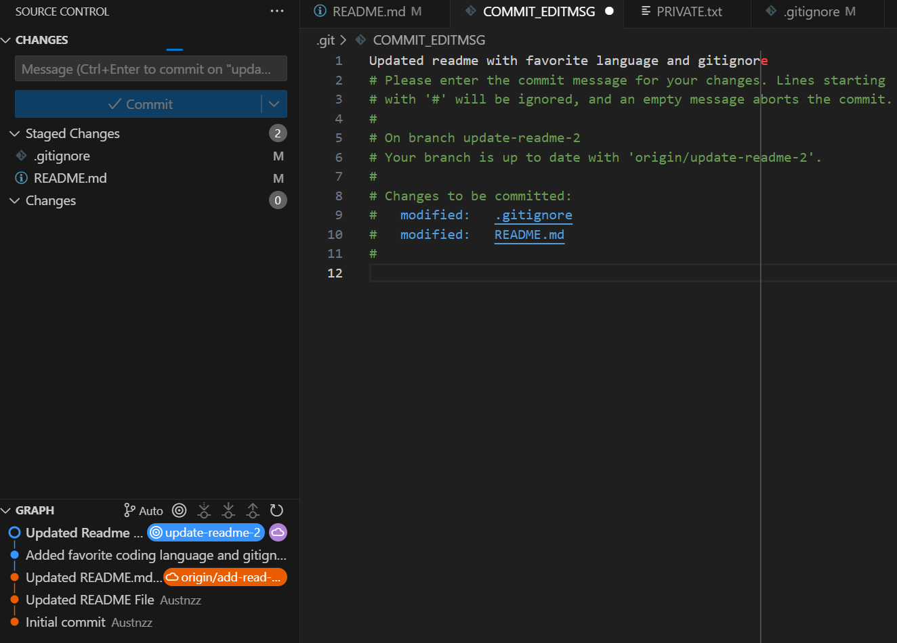

# **Austin Choi's User Page**

# **Styling Text**
## *Slanted Text or something*

# **Quote Text**
## "I'm craving some cheeseburgers" -*Austin*

# **Quote Code**
## Python
'print("Hello World")'

# **Extrenal Links**
## My Git Hub Page
[My GitHub](https://github.com/Austnzz)

# **Section Links**
## Linking to Quote
[Go to Quote](#quote-text)

# **Relative Links**
## Linking to README.md
[README](README.md)

# **Picture**
## Submission Screenshots

# **Unordered List**
## Groceries
- bread
- cheese
- meat

# **Ordered List**
## Program languages
1. Python
2. C++
3. Java

# **Task List**
## Lab 1
- [x] Install VSCode
- [x] Create Repo
- [x] write and update readme
- [ ] make markdown
- [ ] push everything
